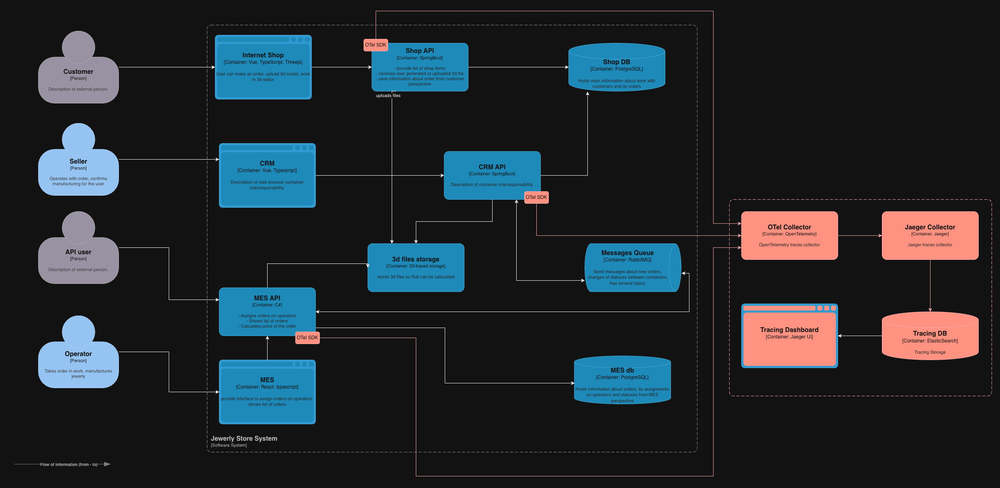
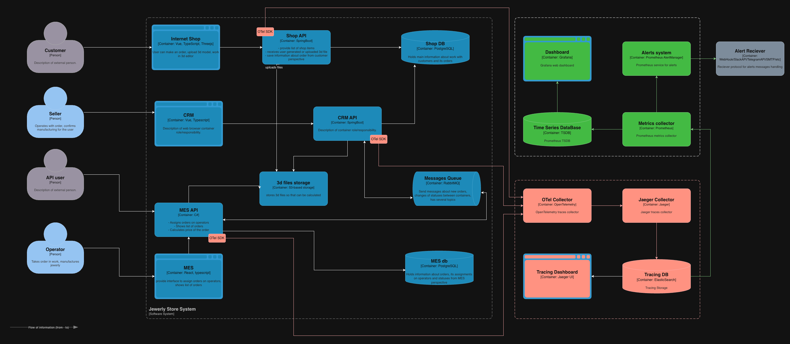

# 1. Область покрытия трейсингом

## Компоненты, которые покрываем трейсингом

1. Online Shop API
2. CRM API
3. MES API

## Где заказ может сломаться или зависнуть

- HTTP границы: Shop > MES, UI > MES, CRM UI > CRM (timeouts/5xx/latency).
- Долгие операции: расчёт стоимости (2–30 минут).
- RabbitMQ:
  - публикация без доставки (routing/binding);
  - падение обработки;
  - redelivery и дубли.
- БД: блокировки, исчерпание соединений, медленные запросы.
- Согласованность статусов: смена статуса произошла, но событие не дошло.
- Интеграции закрытия заказа: нет события, нет `CLOSED`.

## Данные, которые должны попадать в трейсинг

### Корреляция

- `trace_id`, `span_id`
- `order_id`
- `customer_id` / `api_key_id`
- `message_id`, `correlation_id`, `delivery_attempt`, `redelivered` из RabbitMQ
- `calc_task_id`

### Бизнес-атрибуты

- `order_status`
- `source_channel = b2c_web | operator_ui | b2b_api`
- `model_complexity`

### Технические атрибуты

- HTTP: `http.method`, `http.route`, `http.status_code`, `client_type`
- DB: `db.system`, `repo_method`/`db.operation`, `db.duration_ms`
- MQ: `mq.exchange`, `mq.queue`, `mq.routing_key`, `ack|nack`
- Ошибки: `error=true`, `exception.type`, `exception.message`

### Что запрещено включать

- PII (ФИО, телефон, адрес), содержимое 3D-файлов, секреты.

---

# 2. Мотивация

## Зачем нужен трейсинг

Трейсинг нужен, чтобы:
- быстро находить точку потери и зависания заказа;
- уменьшить время расследований и устранения последствий;
- доказуемо приоритизировать улучшения;
- перейти к выявлению проблем до того, как с ними столкнётся клиент.

### Метрики, на которые влияет внедрение

Технические:
1. Скорость реакции и устранения проблем (MTTR)
2. Error rate (5xx) + атрибуция причин  
3. Доля неуспешных асинхронных операций  
4. Доля «застрявших» заказов + p95 времени в статусах (lead time по этапам)
5. Среднее и p95 время прохождения заказа от `SUBMITTED` до `CLOSED`

---

# 3. Предлагаемое решение

## Внедрение трейсинга

- OpenTelemetry SDK - добавляем в сервисы Java/.NET/JS добавляем компоненты SDK,которые генерят trace_id
- OpenTelemetry Collector - точка сбора OTLP трейсов
- Jaeger Collector + Jaeger UI - сбор и визуализации трейсов
- ElasticSearch - хранилище трейсов

[Исходный файл C4](jewerly_c4_model_v1.drawio)

## Автоматический мониторинг и алертинг

### Метрики

В OTel Collector включаем генерацию метрик из spans:
  - Rate/error/duration по `service`, `route`, `status_code`;
  - Среднее время производства;
  - Время заказа в статусе - контроль SLA на этапах `PRICE_CALCULATED`, `MANUFACTURING_STARTED`, `SHIPPED`;
  - Количество застрявших заказов (`orders_stuck_total`) - раннее выявление «тихих» проблем без жалоб клиентов;
  - Ошибки партнёрского API (B2B) - контроль надёжности внешних интеграций;
  - RabbitMQ backlog и возраст сообщений (`oldest_message_age`) - основной индикатор зависаний;
  - Длительность расчёта стоимости - контроль дорогих операций;

Экспорт в Prometheus и Grafana.

### 7.2. Алерты

- Статус заказа превышает > SLA - отправляем алерт бизнесу, поддержке  
- Рост `oldest_message_age` - отправляем алерт DevOps
- Рост DLQ - создаём инцидент с высоким приоритетом
- Рост `orders_stuck_total` - отпарвляем алерт DevOps, поддержке

[Исходный файл C4](jewerly_c4_model_v2.drawio)

 

---

# 4. Компромиссы

- `order_id` не используем как label в метриках из-за высокой кардинальности; держим в trace/log, метрики - агрегированные.
- Инструментирование требует доработок кода, но MES куплен с исходниками - риск приемлемый.
- Трейсинг увеличивает latency и нагрузку на сервисы, особенно на высокочастотных эндпоинтах. Требуется sampling и ограничение количества атрибутов.
- Для S3 и других managed-сервисов доступен только клиентский трейсинг; внутренняя обработка таких систем остаётся «чёрным ящиком».
- Трейсы являются объёмными данными; без строгого retention и sampling стоимость системы быстро растёт.
- При неправильной настройке трейсинг может содержать чувствительные бизнес-данные, что требует санитизации и контроля доступа.
- Трейсинг требует дисциплины команды и поддержки стандартов; без этого его ценность со временем снижается.

---

# 5. Безопасность

- Доступ к UI только сотрудникам (RBAC/ABAC), роли: Support/Dev/SRE.
- Размещение в закрытом сегменте сети, доступ через VPN.
- TLS для OTLP, по возможности mTLS внутри периметра.
- Отсутствие в трассировке чувствительных данных + сроки и политики удаления.