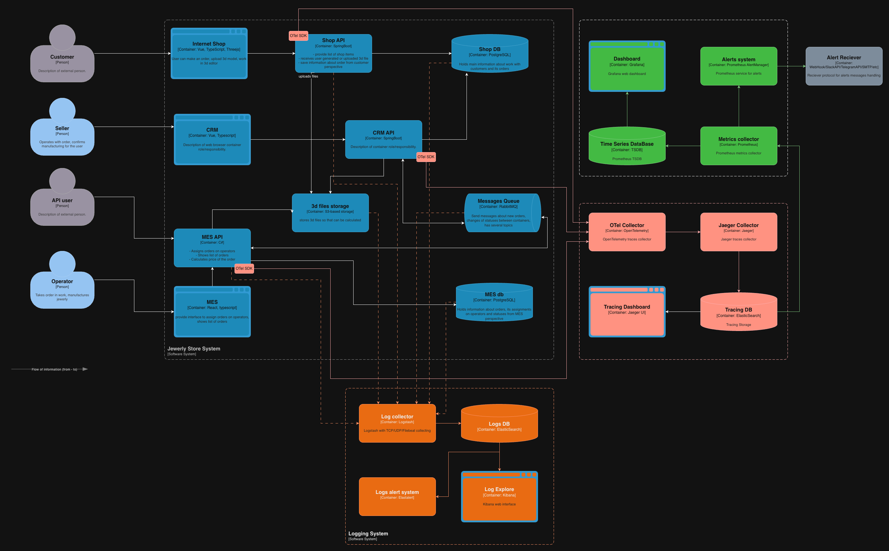

# 1. Что логируем и из каких систем собираем

## Системы, из которых требуется сбор логов

Обязательный контур:
- Online Shop API
- CRM API
- MES API
- RabbitMQ (системные логи + события/ошибки консьюмеров в сервисах)
- PostgreSQL (Shop DB, MES DB) - slow queries, ошибки, подключения (через managed-инструменты/экспортеры и логирование)
- S3-хранилище (ошибки/латентность фиксируем на стороне клиентов: Shop/MES)

## Требования к формату логов

- Структурированные логи в JSON.
- Обязательные поля в каждом сообщении:
  - `timestamp`, `level`, `service`, `env`, `version`
  - `trace_id`, `span_id` (если включён трейсинг)
  - `order_id` (если применимо)
  - `correlation_id` / `message_id` (для RabbitMQ)
  - `request_id` (для HTTP), `path`, `method`, `status_code`, `duration_ms`

---

# 2. Список необходимых INFO-логов

## Online Shop API (INFO)

- `order.created` - создание заказа  
  Поля: `order_id`, `customer_id`, `source_channel=b2c_web`, `timestamp`

- `model.uploaded` - загрузка и создание 3D-модели  
  Поля: `order_id`, `size_bytes`, `duration_ms`, `result=success|fail`

- `order.submitted` - пользователь нажал «Сделать заказ»  
  Поля: `order_id`, `customer_id_internal`, `items_count`, `timestamp`

- `outbound.call.mes` - обращение к MES 
  Поля: `order_id`, `target=mes`, `status_code`, `duration_ms`, `result`

## MES API (INFO)

- `price.calc.requested` - запрос на расчёт стоимости  
  Поля: `order_id`, `source_channel=b2c_web|b2b_api|operator_ui`, `model_complexity_class`, `timestamp`

- `price.calc.completed` - расчёт завершён  
  Поля: `order_id`, `duration_ms`, `price`, `result=success|fail`, `error_type?`

- `order.status.changed` - смена статуса (MANUFACTURING_STARTED/COMPLETED/PACKAGING/SHIPPED)  
  Поля: `order_id`, `from_status`, `to_status`, `operator_id_internal?`, `timestamp`

- `dashboard.query.executed` - выполнение запроса дашборда  
  Поля: `status_filter`, `page_size`, `duration_ms`, `rows_returned`  
  (без сырых SQL и без данных клиента)

- `mq.publish` / `mq.consume` - публикация/получение событий в RabbitMQ  
  Поля: `order_id`, `exchange`, `routing_key`, `message_id`, `correlation_id`, `result=ack|nack|requeue`

## CRM API (INFO)

- `order.status.changed` - смена статуса (MANUFACTURING_APPROVED/CLOSED)  
  Поля: `order_id`, `from_status`, `to_status`, `actor_role=sales|admin`, `timestamp`

- `mq.consume` - получение события от MES (создание/обновление заказа)  
  Поля: `order_id`, `message_id`, `correlation_id`, `result=ack|nack|retry|dlq`

- `order.viewed` - просмотр карточки заказа (для расследований спорных ситуаций)  
  Поля: `order_id`, `actor_role`, `timestamp`

---

## 3. Уровни логирования и правила

- `INFO` - бизнес-события, переходы статусов, ключевые шаги обработки, публикация и получение сообщений.
- `WARN` - аномалии и «почти ошибки»:
  - повторная обработка (redelivery);
  - неожиданный статус;
  - таймауты внешних вызовов, но с успешным ретраем;
  - подозрительный рост нагрузки.
- `ERROR` - ошибки обработки заказа:
  - исключение в бизнес-логике;
  - невозможность обновить статус/записать в БД;
  - недоступность RabbitMQ/БД/S3;
  - уход сообщения в DLQ.
- `DEBUG` - временно, строго по времени или окружению (dev/release), для точечной диагностики.

---

# 4. Мотивация

## Что даёт компании

- Ускоряет разбор инцидентов и снижает нагрузку поддержки: видим факты, а не пересказ клиента.
- Позволяет находить массовые проблемы.
- Даёт доказательную базу для улучшений.
- Упрощает работу с партнёрами B2B: видно, где именно произошёл сбой или дубликат.

## Метрики, на которые влияет внедрение

1. Доля заказов, просроченных относительно SLA.
2. Число обращений в поддержку по статусам и зависаниям.
3. MTTR по инцидентам, связанным с заказами.
4. Error rate (5xx) и доля сообщений в DLQ/redelivery.
5. Latency ключевых операций (дашборд MES, расчёт, обработка событий).

## Что внедряем в первую очередь (логи + трейсинг) и почему

1. MES API - главный узел нагрузки и место длинных операций + интерфейс операторов.
2. CRM API + RabbitMQ consumer - тут часто теряются или дублируются события и заказы.
3. Online Shop API - входной контур B2C и источник ожиданий по срокам.

---

# 5. Предлагаемое решение

## Архитектура логирования (Kubernetes-friendly)

Рекомендуемый стек:
- Сбор: Logstash + Filebeat
- Хранилище/поиск: Elasticsearch
- Визуализация: Kibana

## Что дорабатываем в сервисах

- Переходим на унифицированное JSON-логирование во всех сервисах, внедряя общение с Logstash через протокол UDP + логирование в файл на машине.
- В каждый лог добавляем обязательные поля - service, env, version, request_id, trace_id, order_id.
- Для RabbitMQ: логируем `message_id/correlation_id`, результат `ack/nack/retry/dlq`.

## Безопасность логов

- Санитизация:
  - Запрещаем ФИО, телефон, адрес, токены, API keys, cookies;
  - Маскируем/хэшируем storage keys и чувствительные поля;
  - Не логируем payload сообщений целиком, только метаданные.
- Доступ:
  - Доступ к дашбордам только сотрудникам, RBAC по ролям;
  - Разделение индексов/доступа: поддержка видит «операционные» логи, разработчики - расширенные.
- Периметр:
  - ElasticSearch и дашборды в закрытой сети, доступ через VPN.

## Политика хранения и индексы

- Индексы раздельно по сервисам/окружениям:
  - `logs-mes-prod-*`, `logs-crm-prod-*`, `logs-shop-prod-*`
  - Аналогично для `release/dev`
- Хранение:
  - Prod: 30 дней (по объёму и требованиям)
  - Release: 7–14 дней
  - Dev: 3–7 дней
- Ротация по времени (daily/weekly) 
  - Индекс создаётся автоматически (например, раз в день), после чего к нему применяется политика жизненного цикла. + ILM/ISM политика:
  - Hot > warm > delete
- Лимиты:
  - Ограничиваем размер одного события (truncate больших сообщений) - 32 KB;
  - Если лог большой, то он обрезается, сохраняется начало события, обычно самое важное;
  - При достижении хранилища логов в 300 GB - удаление старых логов.

---

## 6. Превращение сбора логов в анализ

## Общий план
- Стандартизация логов - введение единого JSON-формата и контракта логов (service, env, order_id, trace_id, event_type, level), унификация названий бизнес-событий и уровней логирования.
- Корреляция между системами - обязательный проброс и логирование `order_id`, `trace_id` и `correlation_id` для восстановления полной цепочки обработки заказа между Shop, CRM, MES и RabbitMQ.
- Выделение бизнес-событий - явное логирование ключевых этапов жизненного цикла заказа (создание, расчёт, подтверждение, производство, отгрузка) как структурированных событий, а не текстовых сообщений.
- Агрегация и дашборды - построение агрегированных представлений и дашбордов на основе логов: количество заказов по статусам, время этапов, частота ошибок и redelivery.
- Log-based алертинг - настройка алертов на резкий рост ошибок, DLQ/redelivery, превышение допустимого времени этапов заказа и аномальные всплески бизнес-событий.
- Регулярный анализ и обратная связь - использование логов для postmortem-разборов, выявления повторяющихся проблем и формирования задач в backlog на основе реальных инцидентов.

## Алертинг

Алерты на основе:
- Резкий рост ERROR по сервису - `error_rate` по логам и метрикам;
- Рост DLQ / redelivery - по логам консьюмеров + метрикам RabbitMQ;
- Всплеск 5xx на внешнем API;
- Превышение времени обработки ключевых операций (если логируем duration_ms).

Интеграция алертов:
- Elastalert собирает эвенты и шлёт их в Slack/Telegram/Почту/Jira тикеты и тд.

## Поиск аномалий

- Детект всплесков:
  - `order.created`/`order.submitted` внезапно выросли в N раз
  - `mq.consume` ошибки выросли в N раз
- Триггеры на возможный DDoS или партнёрскую ошибку:
  - Рост RPS от одного `partner_id` - если логируем;
  - Рост 429/503 - если есть rate limit или перегруз

---

## 7. Критерии выбора технологии

| Критерий                         | ELK (Elastic)                                           | OpenSearch                          | Splunk                      | Grafana Loki                      |
|----------------------------------|---------------------------------------------------------|-------------------------------------|-----------------------------|-----------------------------------|
| Лицензия/стоимость               | ограниченная (Elastic License), однако есть self-hosted | Apache 2.0 / более свободная модель | проприетарная, дорого       | OSS, относительно дёшево          |
| Полнотекстовый поиск и аналитика | сильный                                                 | сильный                             | очень сильный               | ограниченный поиск (метки/строки) |
| Экосистема и зрелость            | очень зрелая                                            | зрелая, активно развивается         | enterprise-уровень          | зрелая в связке с Grafana         |
| Стоимость хранения               | средняя/высокая                                         | средняя                             | высокая                     | обычно ниже (chunk storage)       |
| Простота эксплуатации в K8s      | средняя (кластер)                                       | средняя (кластер)                   | сложнее (enterprise)        | проще (особенно для старта)       |
| Поддержка алертов/детекта        | есть                                                    | есть (alerting)                     | есть (сильная)              | есть через Grafana alerting       |
| Подходит для «быстрого MVP»      | да                                                      | да (часто проще по лицензии)        | редко (стоимость/внедрение) | да (если нужен быстрый старт)     |

Выбор для "Александрита": ELK-Stack выбран как зрелая, масштабируемая и функционально богатая платформа, оптимально подходящая для построения системы анализа логов в распределённой, быстро растущей системе с высокой бизнес-критичностью данных.
Компромиссы выбора:
  - эксплуатация Elasticsearch требует дисциплины в настройке индексов, ретеншена и шардирования;
  - при неконтролируемом росте логов возможен рост стоимости инфраструктуры;
  - часть продвинутых функций доступна только в коммерческих лицензиях (однако, есть бесплатные аналоги).

[Схема C4](jewerly_c4_model_v3.drawio)

