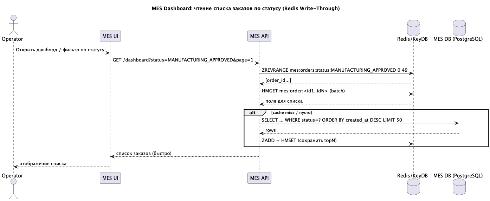
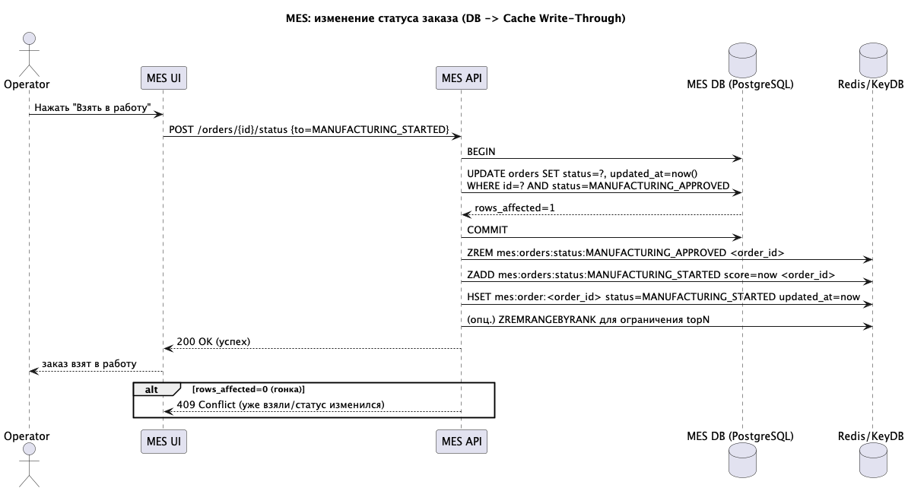

# 1. Какую часть системы имеет смысл закешировать

## Принципы выбора

Кешируются только те части системы, которые:
- читаются значительно чаще, чем изменяются;
- формируются ресурсоёмкими SQL-запросами (фильтрация + сортировка по неуникальным полям);
- критичны к задержке для пользователей;
- могут быть представлены в виде read-модели и не являются источником истины.

## Основной объект кеширования (MVP)

MES: дашборд "Заказы в работе"

Это самый нагруженный и бизнес-критичный сценарий:
- используется всеми операторами постоянно;
- требует отображения самых новых заказов;
- вызывает тяжёлые SQL-запросы при росте объёма данных.

Кешируется:
- списки последних заказов по каждому операционному статусу  
  (`MANUFACTURING_APPROVED`, `MANUFACTURING_STARTED`, `PACKAGING`, `SHIPPED`);
- только top N заказов (например, 200–500) для каждого статуса.

В кеше хранится минимальная read-модель заказа:
- `order_id`
- `status`
- `created_at`
- `updated_at`

## Вторичный объект кеширования

MES: карточка заказа

Кешируется часто открываемая часть карточки заказа:
- текущий статус;
- ключевые параметры изделия;
- краткая история статусов.

Это позволяет сохранить выигрыш по скорости после выбора заказа из списка.

# 2. Мотивация

## Бизнес-мотивация

В текущей архитектуре MES является критически важным звеном всей цепочки обработки заказов. От скорости работы интерфейса MES напрямую зависят:
- время реакции операторов на новые заказы;
- скорость запуска заказа в производство;
- соблюдение заявленных сроков изготовления и доставки.

Медленная загрузка дашборда приводит к следующим последствиям:
- операторы поздно видят новые заказы и берут их в работу с задержкой;
- растёт среднее время ожидания заказа в статусах до начала производства;
- увеличивается количество жалоб клиентов и партнёров;
- снижается доверие к платформе и теряются B2B-контракты.

Внедрение кеширования позволяет ускорить ключевые пользовательские сценарии без немедленного масштабирования производственных мощностей и баз данных, что даёт быстрый и экономически эффективный эффект для бизнеса.

## Техническая мотивация

С технической точки зрения текущая реализация дашборда MES имеет следующие проблемы:
- частые запросы к большим таблицам заказов с фильтрацией по статусу и сортировкой по времени;
- рост времени выполнения SQL-запросов по мере увеличения объёма данных;
- высокая нагрузка на CPU и I/O базы данных даже при использовании пагинации;
- невозможность эффективно масштабировать чтение без существенного усложнения схемы БД.

Кеширование позволяет:
- вынести наиболее частые операции чтения из базы данных;
- стабилизировать время ответа API независимо от объёма данных;
- снизить пиковые нагрузки на MES DB;
- создать основу для горизонтального масштабирования MES API.

---

# 3. Предлагаемое решение

## Тип кеширования

Предлагается выбрать серверное кеширование, а не клиентское по следующим причинам:
- Консистентность данных для всех операторов - операторы конкурируют за одни и те же заказы, поэтому требуется единая актуальная картина данных; клиентское кеширование приводит к рассинхронизации и отображению устаревших статусов.
- Снижение нагрузки на сервер и базу данных - клиентский кеш снижает количество запросов только от одного пользователя, но не уменьшает общую нагрузку при одновременной работе множества операторов; серверный кеш эффективно разгружает MES API и БД.
- Управляемая инвалидация и масштабируемость - серверное кеширование позволяет централизованно обновлять и инвалидировать данные при смене статусов и остаётся эффективным при горизонтальном масштабировании системы.

## Технология

В качестве кеш-хранилища предлагается использовать Redis Cluster (Либо совместимый KeyDB).

## Паттерн кеширования

Используется паттерн Write-Through с TTL как страховочным механизмом.

- При изменении статуса заказа:
  - сначала выполняется запись в БД;
  - затем синхронно обновляется кеш.
- Кеш хранит заранее вычисленные списки заказов по статусам (top N).

### Почему выбран Write-Through

- высокая актуальность данных для операторов;
- отсутствие пиков нагрузки на БД;
- предсказуемое поведение при конкурентных изменениях.

### Почему не Cache-Aside

- возможны пики обращений в БД после инвалидации;
- хуже подходит для часто изменяемых данных.

### Почему не Refresh-Ahead

- требует планирования обновлений;
- избыточен для событийной модели смены статусов.

## Диаграммы последовательностей

### Чтение

[Исходный файл](read.puml)

### Запись

[Исходный файл](write.puml)

## Стратегия инвалидации кеша

Используется комбинированная стратегия:
- Инвалидация и обновление по ключу (программная) при изменении статуса заказа: обновление списков по статусам и read-модели заказа.
- TTL для страховки (например, 5–15 минут) на ключи read-модели и списки: защищает от редких случаев рассинхронизации при сбоях обновления кеша.

Почему подходит:
- смена статуса - событие, которое удобно "перехватить" в коде MES API и синхронно обновить кеш;
- операторам важна актуальность, поэтому TTL-only недостаточен;
- снижает пики нагрузки на БД по сравнению с Cache-Aside.

### Сравнение стратегий

| Стратегия            | Плюсы                             | Минусы                                                                              | Подходит для MES дашборда   |
|----------------------|-----------------------------------|-------------------------------------------------------------------------------------|-----------------------------|
| TTL-only             | очень простая                     | риск устаревших данных до истечения TTL                                             | плохо                       |
| Cache-Aside          | простая реализация                | пики обращений к БД после инвалидации, нестабильность при высокой частоте изменений | хуже                        |
| Инвалидация по ключу | актуальность, near-realtime       | требует дисциплины обновления и корректной обработки ошибок                         | отлично                     |
| Refresh-Ahead        | сглаживает нагрузку, снижает miss | сложнее, нужен планировщик/джоб и правила обновления                                | возможно, но не обязательно |

## Альтернативные варианты решения

|                  | Решение 1: Redis/KeyDB                                                          | Решение 2: Read-model в PostgreSQL                                   |
|------------------|---------------------------------------------------------------------------------|----------------------------------------------------------------------|
| Описание решения | Распределённый кеш + read-model для списков/карточки                            | Оптимизированное чтение из БД через отдельную модель/индексы         |
| Плюсы            | Максимальная скорость чтения, сильное снижение нагрузки на БД, масштабируемость | Инфраструктурно проще, единое хранилище, меньше компонентов          |
| Минусы           | Нужна дисциплина инвалидации, добавляется компонент Redis                       | Нагрузка на БД растёт с объёмом данных, возможна деградация на пиках |
| Риски            | Рассинхронизация, рост кеша                                                     | Дорогие сортировки и IO при росте, сложная оптимизация запросов      |
| Рекомендация     | Основное решение для быстрого эффекта и роста нагрузки                          | Можно использовать в качестве MVP, но не как единственное решение    |

По результатам сравнения предпочтительным является Redis/KeyDB с паттерном Write-Through.

Данное решение лучше соответствует текущим проблемам MES, так как:
- обеспечивает минимальную задержку при чтении дашборда и быстрый отклик для операторов;
- существенно снижает нагрузку на MES DB, важно для роста числа заказов;
- хорошо масштабируется при увеличении количества операторов и инстансов MES API;
- позволяет централизованно управлять актуальностью данных и инвалидацией кеша;
- создаёт основу для дальнейшего горизонтального масштабирования и роста системы.

Решение с read-моделью в PostgreSQL может использоваться как временная оптимизация или дополнительная мера, но при дальнейшем росте нагрузки оно не решает проблему системно и ограничено возможностями одного хранилища.

Таким образом, внедрение распределённого серверного кеширования на базе Redis является наиболее эффективным и устойчивым архитектурным выбором для MES.
